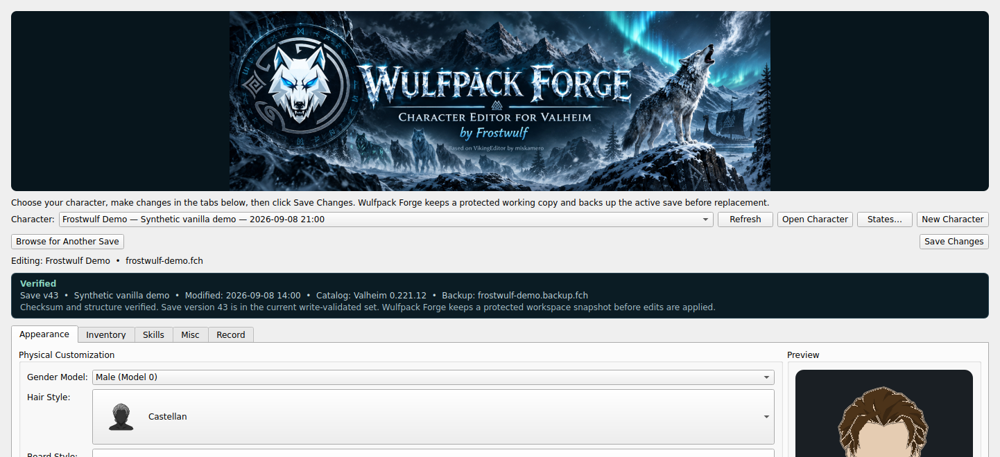
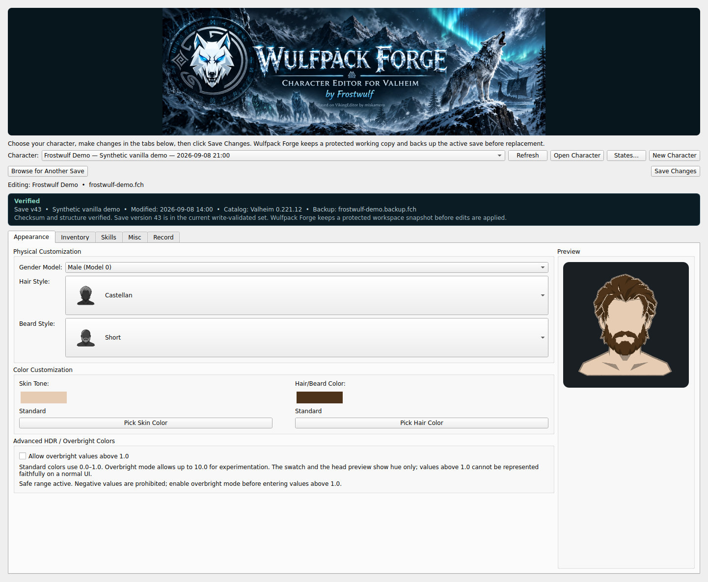
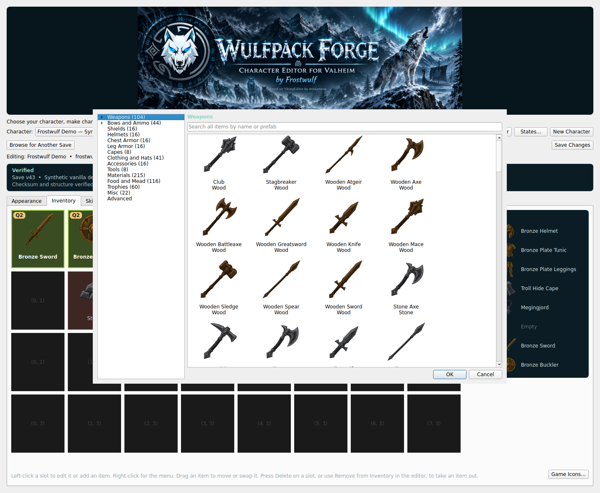
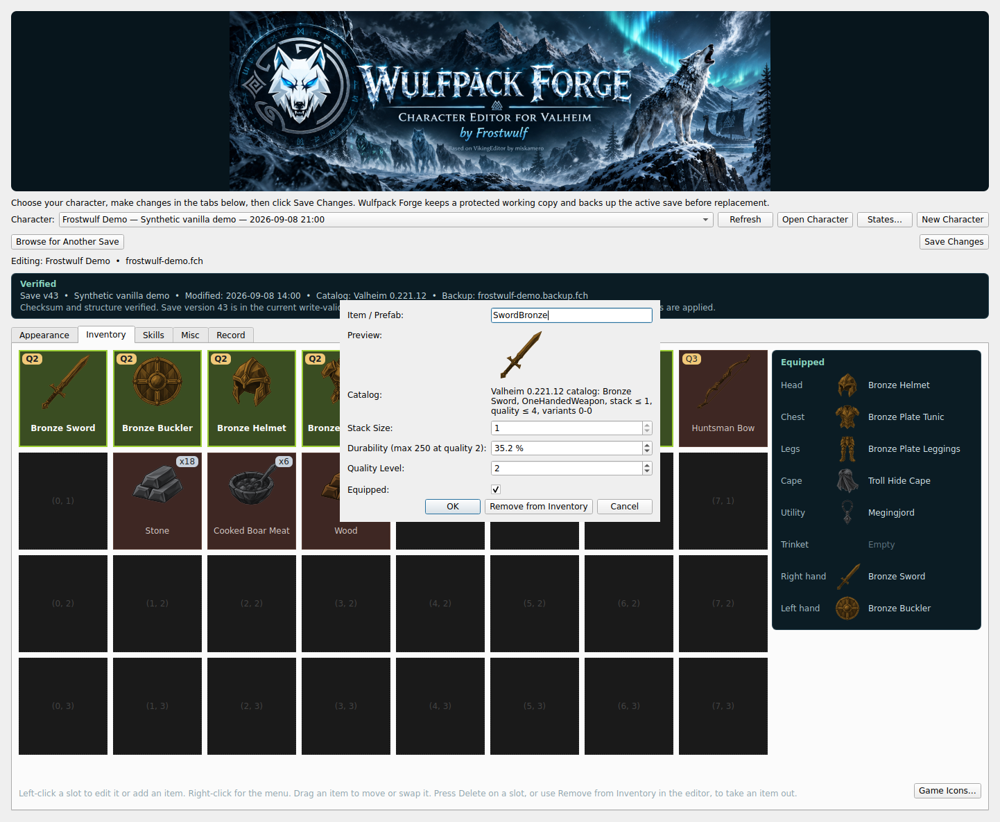

<p align="center">
  
</p>

<h1 align="center">Wulfpack Forge</h1>
<p align="center"><strong>Character Editor for Valheim</strong><br>by Frostwulf</p>
<p align="center"><em>Based on <a href="https://github.com/miskamero/VikingEditor">VikingEditor</a> by miskamero</em></p>

<p align="center">
  <a href="https://github.com/Knapp-Kevin/WulfPackForge/actions/workflows/tests.yml"></a>
  <a href="https://github.com/Knapp-Kevin/WulfPackForge/actions/workflows/package-windows.yml"></a>
  <a href="LICENSE"></a>
</p>

Wulfpack Forge is a player-first desktop editor for Valheim character saves. It is designed for the person who wants to change a beard, hair color, inventory item, or skill without learning Python, searching obscure save folders, or gambling a character file on a direct overwrite.

Once the first public Windows release is published, the intended player path is deliberately simple: download the Windows build, open a character that exists locally, make changes, and click **Save Changes**. Underneath that workflow, Wulfpack Forge verifies save structure and checksums, creates a protected workspace snapshot and working copy, detects outside changes to the active character, blocks writes while Valheim is running, backs up the active save, and only replaces it after the edited candidate passes validation.

> **Unofficial community software.** Wulfpack Forge is not affiliated with, authorized by, or endorsed by Iron Gate Studio or Coffee Stain Publishing.

## Current availability

**No public Windows release has been published yet.** The Windows workflow builds and smoke-tests `WulfpackForge.exe` and `WulfpackForge-windows-x64.zip`, but its temporary GitHub Actions artifacts are validation evidence, not durable public releases.

You can still use Wulfpack Forge now by running it from source. On Windows, the included launcher reduces setup and startup to one file after Python is installed. This is a source setup, not a packaged installer.

The first public release remains gated on the Valheim 1.0 compatibility work in [issue #2](https://github.com/Knapp-Kevin/WulfPackForge/issues/2). When that gate passes, the packaged Windows build will provide the no-Python download-and-run experience described above.

### Run now on Windows

1. Install [64-bit Python 3.12](https://www.python.org/downloads/windows/) and keep the Python launcher selected during installation.
2. [Download the current Wulfpack Forge source ZIP](https://github.com/Knapp-Kevin/WulfPackForge/archive/refs/heads/main.zip) and extract the entire ZIP.
3. Double-click **`run-wulfpack-forge.cmd`** in the extracted folder.

The launcher creates a private Python environment inside the extracted folder, installs the pinned dependencies on the first run, and starts Wulfpack Forge. The first run needs an internet connection and may take several minutes. Later runs reuse that environment unless `requirements.txt` changes.

The current build enables saving for character-save format versions 40 through 43 whose player data uses the known layout. A structurally valid save with any other version can be inspected, but **Save Changes** remains disabled. Valheim 1.0 compatibility has not been claimed or validated yet.

## See it in action

The compact status card tells you whether the selected save is verified for editing, where the local copy came from, and whether Wulfpack Forge has a protected backup.



Appearance controls use readable choices and color previews, so changing a model, hairstyle, beard, or color does not require save-format knowledge.



Inventory editing combines the familiar character grid with original item-category glyphs, material tinting, searchable catalog guidance, known stack and quality limits, and a raw-prefab path for modded or newer items.



Known equipment is edited against its quality-based durability maximum, while untouched durability values are preserved exactly.



## What Wulfpack Forge can edit

| Area | Capabilities |
|---|---|
| Appearance | Skin color, shared hair/beard color, hair style, beard style, supported model settings, a live head preview that updates as you choose, plus guarded HDR/overbright RGB editing from 0.0 through 10.0 |
| Inventory | Large illustrated grid with stack and quality badges, drag-and-drop to move or swap items, and an Equipped panel showing what occupies each slot; item picker organised by category, then type, then material (Weapons > Swords > Bronze) with counts, a breadcrumb, and clothing, accessories, and creature gear kept apart from armour; search, raw prefab entry for modded items; stacks, durability as a percent of the real maximum for the chosen quality, quality, styles where an item has them, and equipped state with the game's one-item-per-slot rule; remove an item with Remove from Inventory in the editor, the Delete key, or right-click |
| Skills | Supported Valheim skill levels, including adding one or all vanilla skills the character does not have yet |
| Character details | Supported character-level fields such as name |
| New characters | Create a brand-new character (name, model, hair, beard, colours) with the game's starting defaults, then edit it like any other |

### Creating a character

**New Character** on the main window writes a fresh `.fch` file into the Valheim characters folder you choose, using the exact defaults the game writes for a new character (starting torch and rag tunic, no skills yet, first-spawn intro pending). The file is verified before it is placed, an existing character with the same name is never overwritten, and the new character opens in the editor immediately. Use the Skills tab's **Add Skill** or **Add All Skills** to give it vanilla skills.

Characters created by Wulfpack Forge have been loaded and played in Valheim 0.221.12 as part of the release evidence (2026-09-07), alongside edited existing characters; the created file layout is byte-for-byte the layout of a character created in-game on the same build. Vitals such as maximum health and stamina are recalculated by the game from active food, so they are starting points rather than fixed values.

Known vanilla items use human-readable names and an appropriate original silhouette while retaining their prefab IDs. Unknown, modded, or newer-version items are preserved and receive a neutral fallback glyph rather than being rejected simply because the bundled catalog does not recognize them.

## Advanced HDR / overbright appearance colors

Normal appearance editing stays deliberately simple: the standard color picker writes ordinary `0.0` through `1.0` RGB values. For players who intentionally want brighter values, the Appearance tab includes an explicit **Advanced HDR / Overbright Colors** mode for skin and the shared hair/beard color.

The advanced controls are guarded rather than silently widening every color picker:

- **Overbright is opt-in.** Values above `1.0` can only be entered after enabling the advanced checkbox.
- **Negative values are prohibited.** Every RGB component has a hard minimum of `0.0`; Wulfpack Forge will not create underbright/negative color values.
- **The supported editing range is `0.0` through `10.0`.** This allows experimentation without exposing unbounded float input.
- **Presets preserve hue.** `Normal 1×`, `Bright 2×`, `Glow 4×`, and `Extreme 8×` rescale the selected skin, hair/beard, or both while retaining the original RGB proportions.
- **Extreme values are called out.** Values above `4.0` show a stronger warning because they may bloom heavily, wash out the model, or render poorly in-game.
- **Existing overbright characters are preserved.** If a loaded character already contains values above `1.0`, Wulfpack Forge enables the advanced surface automatically and round-trips those floats without clamping them back into the ordinary range.
- **The preview is intentionally honest.** A normal desktop swatch (and the head preview) cannot represent HDR intensity, so they show the hue while a separate label displays the actual stored peak intensity.

Wulfpack Forge writes these appearance values as the same floating-point RGB fields already present in Valheim character data. The editor can preserve and write overbright values, but the final visual result still depends on how the current Valheim material/shader handles those values for skin, hair, and beard. The feature therefore describes the stored data accurately without promising that every value produces a particular amount of visible glow in every game build.

## Character discovery and Steam Cloud

Wulfpack Forge reads **character files that exist on the local computer**.

It searches the normal Valheim local-save directories and Steam userdata locations for `.fch` files that have been synchronized to disk. A character that exists only remotely in Steam Cloud cannot be opened until Steam has downloaded or synchronized a local copy.

If no character appears:

1. Make sure Steam is online and synchronization is complete.
2. Launch Valheim and confirm the character is visible there.
3. Exit Valheim so the save is no longer in use.
4. Return to Wulfpack Forge and click **Refresh**.
5. Use **Browse for Another Save** if you already have the `.fch` file in a custom location.

Wulfpack Forge does **not** connect to a remote Steam Cloud API or download saves directly from Valve.

## Managed character workspace

Opening a verified character creates a Wulfpack Forge workspace outside Valheim's own save directories. On Windows the default root is `%LOCALAPPDATA%\WulfpackForge`.

For each active character, Wulfpack Forge keeps:

```text
WulfpackForge/
└── characters/
    └── active/
        └── <character-id>/
            ├── source/      # immutable snapshots captured when the character is opened
            ├── working/     # current verified Wulfpack Forge working copy
            ├── backups/     # previous active saves preserved before replacement
            └── metadata.json
```

The workspace is deliberately separate from Valheim and Steam directories. Wulfpack Forge does not create organizational folders inside the game's save tree or ask Steam Cloud to synchronize its internal working files.

The source snapshot gives the editing session an immutable baseline. The working copy gives Wulfpack Forge a durable verified representation of the intended edit before the active game file is touched. Immediately before replacement, Wulfpack Forge compares the active character against the hash recorded when it was opened. If Steam, Valheim, another editor, or another process changed that file, saving is blocked and the player is asked to reload rather than overwriting the newer state.

## Character status

The main window exposes a compact status surface instead of hiding safety state in tooltips and dialogs.

Current states are intentionally specific:

- **Verified** means checksum and structure verification passed and the character save version is in Wulfpack Forge's current write-validated set.
- **Compatibility unverified** means the file verifies structurally, but its save version has not been validated for writing. It may be inspected, but **Save Changes** is disabled.
- **Needs attention** means verification failed or the active source changed outside Wulfpack Forge after it was opened.

The status also shows the save version, source, modification time, bundled Valheim catalog version, and the most recent backup when available.

## Save safety

Character editing should not require optimism as a recovery plan. Wulfpack Forge uses a preservation-first write path:

- **Immutable opened snapshot.** A verified copy of the source is preserved in the managed workspace when editing begins.
- **Verified working copy.** The edited candidate is verified and stored in the Wulfpack Forge workspace before the active save is replaced.
- **External-change detection.** The active source hash is checked before replacement so newer Steam, Valheim, or external edits are not silently overwritten.
- **Preserve-by-default write-back.** Only the fields you actually change are written. Skills, hairstyles, beards, foods, items, and mod data that the editor does not recognise pass through untouched, and saving without changing anything produces an identical file.
- **Valheim process protection.** Writes are blocked while Valheim is running, with a second check immediately before replacement. If that check cannot identify every running process, Wulfpack Forge keeps your verified edit in its workspace, leaves the active character untouched, and asks you to close Valheim and save again.
- **Candidate-first compilation.** Edited data is compiled to a temporary `.fch` candidate inside the Wulfpack Forge workspace rather than written over the destination.
- **Strict SHA-512 verification.** The generated save envelope and checksum are validated.
- **Round-trip verification.** The candidate is reparsed and compared with the expected serialized data.
- **Automatic timestamped backup.** The current active save is copied into the character's Wulfpack Forge workspace before replacement.
- **Atomic replacement.** The active destination changes only after verification succeeds.
- **Failure-safe behavior.** If verification or source-consistency checking fails, the existing active destination is left untouched.

Backups are still worth keeping for characters you care about, especially around major game updates or heavily modded saves. The point is that the editor should add protection, not outsource it to the player's memory.

## Valheim compatibility

The bundled item catalog is currently generated from **Valheim 0.221.12** data and contains more than 900 player-selectable vanilla items.

Valheim 1.0 is scheduled for **September 9, 2026**. Wulfpack Forge will not claim post-1.0 compatibility merely because the application launches. The release gate tracked in [issue #2](https://github.com/Knapp-Kevin/WulfPackForge/issues/2) requires a deliberate catalog refresh plus real 1.0 character-save validation, including load, no-op round trip, appearance editing, inventory editing, backup behavior, atomic replacement, and in-game acceptance.

The current parser/serializer is write-validated for character-save versions **40 through 43**: real saves of each version round-trip byte-identical through the codec, and the inner player-data layout is checked separately. A structurally valid save using any other character-save version, or an unknown player-data layout, is shown as **Compatibility unverified** and remains read-only until it has its own evidence.

Until the 1.0 gate passes, unknown items are preserved conservatively. They may be modded content or legitimate items introduced by a newer Valheim build.

## Item catalog design

The player-facing catalog is generated from JotunnDoc vanilla Valheim item data and committed as `data/valheim_items.json`.

Catalog discovery and save-writing constraints are intentionally separated:

- the generated catalog supplies names, types, asset identifiers, selectability, and source-version metadata;
- the curated constraint layer controls known stack, quality, and variant limits;
- a catalog refresh therefore cannot silently loosen save-writing rules;
- raw prefab entry remains available for modded and unknown content.

For the current pre-1.0 snapshot:

```bash
python tools/update_item_catalog.py --expected-version 0.221.12
```

The generator refuses unexpected source-version drift and suspiciously small catalogs so a game update cannot silently rewrite the application data model.

Item durability is maintained separately in `data/valheim_durability.json`. `tools/update_item_durability.py` builds that table from Valheim community wiki item pages, records only numeric durability facts, and preserves the source attribution in the generated file. For a known item and quality, Wulfpack Forge calculates the maximum as `base + per_level * (quality - 1)` and presents the saved durability as a percentage of that maximum. Unknown durability data stays on the raw-value path rather than being guessed.

## Running from source

Source installation is intended for contributors, developers, and advanced users.

### Requirements

- Python 3.10 through 3.14; Python 3.12 is recommended and used by Windows CI
- Git

### Clone

```bash
git clone https://github.com/Knapp-Kevin/WulfPackForge.git
cd WulfPackForge
```

### Install

```bash
python -m pip install -r requirements.txt
```

### Run

```bash
python main.py
```

Windows users may instead double-click `run-wulfpack-forge.cmd` after cloning or extracting the repository. The launcher manages its own environment and dependencies.

## Building the Windows application

The repository uses PyInstaller to produce a self-contained Windows executable. The packaging workflow:

- installs application dependencies;
- runs the automated test suite;
- builds `WulfpackForge.exe`;
- bundles `data/valheim_items.json`, `data/valheim_durability.json`, the canonical banner, the Frostwulf application icon, 34 original inventory glyph masters, and the complete hair and beard thumbnail sets under `assets/glyphs/hair/` and `assets/glyphs/beard/`;
- embeds `assets/wulfpack-forge.ico` as the Windows executable icon;
- smoke-tests the packaged executable and required assets;
- creates a Windows ZIP package;
- generates SHA-256 checksums;
- uploads the build as a workflow artifact;
- publishes release assets for version tags.

## Development and validation

Automated coverage currently includes:

- save-safety behavior;
- checksum and round-trip verification;
- managed workspace snapshots and working copies;
- external active-source change detection;
- workspace-managed backups;
- local and Steam-synchronized character discovery;
- save-health and compatibility-state derivation;
- item catalog generation and version drift;
- catalog resolution and duplicate-name behavior;
- item grouping by category, type, and material, plus equipment roles, slots, hand conflicts, and one-item-per-slot enforcement;
- unknown/modded item preservation;
- inventory drag-and-drop moves and swaps, equipment-panel refreshes, and item removal through the editor, Delete key, and inventory actions;
- durability-page parsing, quality-based maximum calculations, percent editing, raw fallback, and exact preservation of untouched durability values;
- inventory glyph mapping, fallback, tinting, decoding, and transparency;
- live appearance-preview composition, beard-to-face fitting, preset anchoring, and non-mutating style and colour updates;
- guarded HDR/overbright appearance controls, negative-value prevention, preset behavior, and unclamped round-trip preservation;
- new-character construction, strict verification, calibrated defaults, collision refusal, and non-overwriting placement;
- failure logging, rotating log-file setup, and graceful handling when the workspace log path is unavailable;
- structural limits enforced by `tests/test_razor.py`: at most 250 lines per source file, 40 lines per function, and three control-flow nesting levels, with no star imports and no PySide6 imports outside `ui/`;
- offscreen Qt widget behavior;
- Wulfpack Forge branding identity and decodable runtime asset validation;
- Python source compilation;
- packaged Windows executable smoke testing.

The durable product roadmap is [issue #2](https://github.com/Knapp-Kevin/WulfPackForge/issues/2).

## Project structure

```text
├── main.py
├── assets/
│   ├── FrostWulf-favicon.png
│   ├── wulfpack-forge-banner.jpg
│   ├── wulfpack-forge.ico
│   └── glyphs/
│       ├── items/
│       ├── hair/
│       └── beard/
├── data/
│   ├── items.py
│   ├── item_groups.py
│   ├── equipment.py
│   ├── glyphs.py
│   ├── appearance.py
│   ├── durability.py
│   ├── skills.py
│   ├── powers.py
│   ├── valheim_items.json
│   └── valheim_durability.json
├── subscripts/
│   ├── binaryIO.py
│   ├── fchUtil.py
│   ├── playerDataUtil.py
│   ├── saveSafety.py
│   ├── saveHealth.py
│   ├── workspace.py
│   ├── saveFlow.py
│   ├── saveErrors.py
│   ├── characterDiscovery.py
│   ├── valheim_detection.py
│   ├── newCharacter.py
│   └── logSetup.py
├── tools/
│   ├── update_item_catalog.py
│   ├── update_item_durability.py
│   └── make_app_icon.py
├── ui/
│   ├── mainWindow.py
│   ├── characterPicker.py
│   ├── brandBanner.py
│   ├── messages.py
│   ├── saveStatusWidget.py
│   ├── appearanceTab.py
│   ├── appearancePreview.py
│   ├── hdrColorControls.py
│   ├── newCharacterDialog.py
│   ├── inventoryTab.py
│   ├── inventorySlot.py
│   ├── itemPickerDialog.py
│   ├── itemEditDialog.py
│   ├── equipmentPanel.py
│   ├── skillsTab.py
│   ├── miscTab.py
│   ├── glyphs.py
│   ├── branding.py
│   └── fieldTracker.py
├── tests/
└── .github/workflows/
```

## Governance and community

Wulfpack Forge is intentionally small, but not undocumented. The repository keeps the rules that matter close to the code:

- [CONTRIBUTING.md](CONTRIBUTING.md) explains development workflow and contribution expectations.
- [GOVERNANCE.md](GOVERNANCE.md) defines maintainer authority, safety invariants, compatibility policy, and release gates.
- [SECURITY.md](SECURITY.md) covers vulnerability and save-integrity reporting.
- [SUPPORT.md](SUPPORT.md) provides player troubleshooting and support boundaries.
- [CODE_OF_CONDUCT.md](CODE_OF_CONDUCT.md) defines community conduct expectations.
- [CHANGELOG.md](CHANGELOG.md) records user-facing changes.

Changes that affect save parsing, save writing, compatibility claims, catalog constraints, or release artifacts require evidence appropriate to the risk. A green interface is not proof that a save editor is safe. Unfortunately, software has made this lesson necessary.

## Project lineage and attribution

**Wulfpack Forge** is a modified and expanded derivative of **VikingEditor** by **miskamero**.

Original project: https://github.com/miskamero/VikingEditor

This distribution preserves the original project's attribution and is distributed under the **GNU General Public License v3.0**. See [LICENSE](LICENSE) and [NOTICE](NOTICE) for the applicable terms and attribution requirements.

The name **Wulfpack Forge** is used for this modified distribution so it is clearly distinguished from the original VikingEditor project.

## Contributing

Issues and pull requests are welcome. Before contributing, read [CONTRIBUTING.md](CONTRIBUTING.md). The core rule is simple: **never make an irreversible save change when a safer path is practical.**

## Disclaimer

Wulfpack Forge modifies Valheim character save data. No save editor can guarantee compatibility with every game update, mod, or future save-format change.

Keep important saves backed up, especially before major Valheim updates or when using modded characters.
